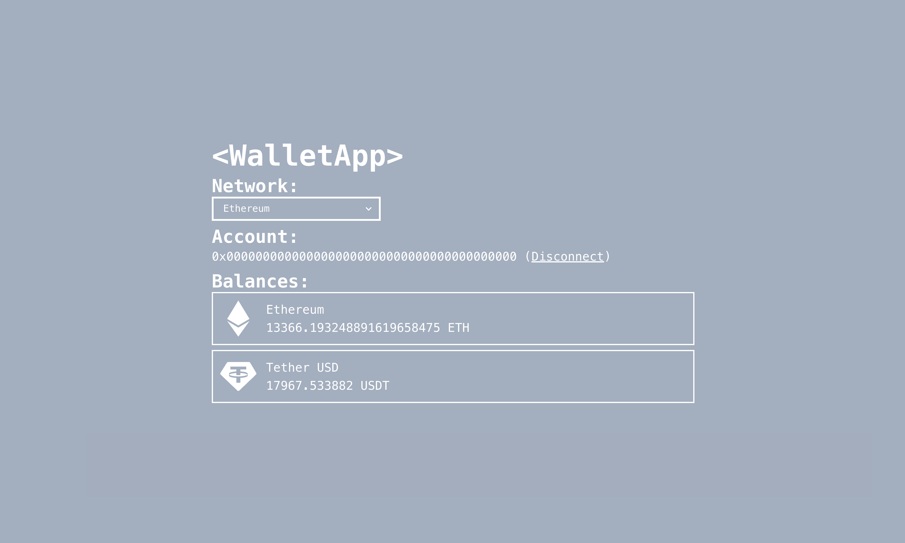
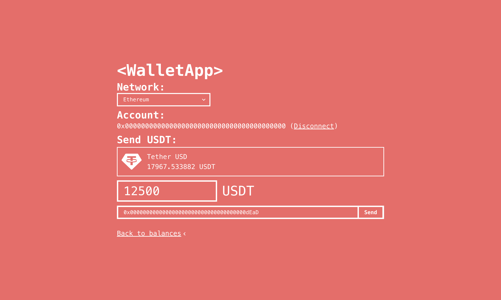

# wallet-app

## 概要

-   テスト用のウォレットアプリ (React + Next.js + Wagmi)
-   Vercel: [wallet-app-zeta.vercel.app](https://wallet-app-zeta.vercel.app/)



## 導入手順

環境構築

```
git clone https://github.com/el3ctricpenguin/wallet-app.git
cd wallet-app
npm i
```

サーバー実行

```
npm run dev
```
